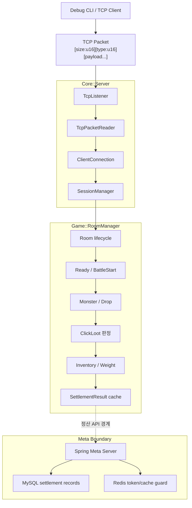
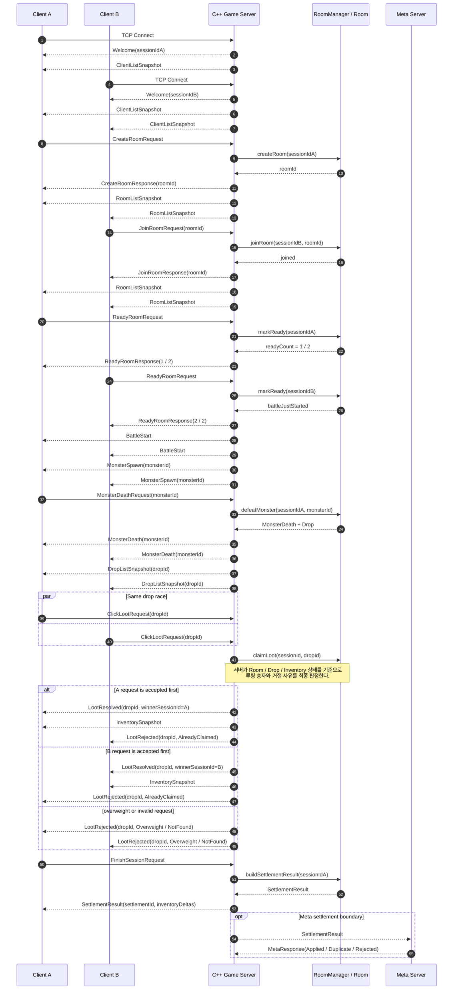

# Loot of Legends

> 클라이언트 입력을 신뢰하지 않고, **서버가 Room 상태와 루팅 소유권을 최종 판정**하는 실시간 게임 서버 포트폴리오 프로젝트입니다.

`C++17` · `CMake` · `POSIX/BSD Sockets` · `TCP/UDP/RUDP` · `GoogleTest` · `Java 21` · `Spring Boot` · `MySQL/Redis` · `Server Authoritative` · `Debug CLI`

---

## 목차

- [프로젝트 요약](#프로젝트-요약)
- [현재 구현 상태](#현재-구현-상태)
- [이 프로젝트가 증명하는 것](#이-프로젝트가-증명하는-것)
- [시스템 구조](#시스템-구조)
- [서버 권한 게임플레이 흐름](#서버-권한-게임플레이-흐름)
- [핵심 불변식](#핵심-불변식)
- [구현 범위](#구현-범위)
- [패킷 프로토콜 요약](#패킷-프로토콜-요약)
- [Debug CLI 시연](#debug-cli-시연)
- [빌드 / 실행 / 테스트](#빌드--실행--테스트)
- [테스트로 검증하는 시나리오](#테스트로-검증하는-시나리오)
- [코드 읽기 가이드](#코드-읽기-가이드)
- [로드맵](#로드맵)
- [현재 한계](#현재-한계)

---

## 프로젝트 요약

**Loot of Legends**는 Room 기반 멀티플레이 세션 안에서 몬스터 처치, 드롭 생성, 클릭 루팅 경쟁, 인벤토리/무게 검증, 세션 종료 정산 결과 생성을 C++ 서버가 처리하는 게임 서버 프로젝트입니다.

이 프로젝트의 핵심은 “게임 화면”이 아니라 **서버 권한 판정 구조**입니다. 클라이언트는 `ready`, `debug_defeat_monster`, `click_loot`, `finish_session` 같은 요청을 보낼 뿐이며, 실제 상태 전이와 최종 결과는 서버가 결정합니다.

```text
여러 플레이어가 동시에 같은 드롭을 클릭한다.
        ↓
서버가 Room 상태와 Drop 상태를 기준으로 승자를 확정한다.
        ↓
승자에게 LootResolved + InventorySnapshot을 보낸다.
패자에게 LootRejected를 보낸다.
        ↓
세션 종료 시 SettlementResult로 휘발 상태를 정산 경계로 넘긴다.
```

이 저장소는 포트폴리오 검토를 위한 공개용 소스 미러입니다.

---

## 현재 구현 상태

| 영역 | 상태 | 설명 |
| --- | --- | --- |
| C++ TCP 게임 서버 | 완료 | TCP 접속, 세션 발급, Room 생성/입장/퇴장, Ready/BattleStart, Monster/Drop/Loot 흐름 구현 |
| 서버 권한 루팅 MVP | 완료 | 동일 Drop에 대한 `ClickLoot` 요청을 서버가 판정하고, 한 명에게만 소유권을 확정 |
| 인벤토리/무게 검증 | 완료 | 루팅 성공 시 서버 인벤토리와 무게를 갱신하고 `InventorySnapshot` 송신 |
| Debug CLI | 완료 | Unity 없이도 서버 흐름을 명령 단위로 재현 가능한 개발용 클라이언트 |
| `SettlementResult` 계약 | 완료 | `finish_session` 요청에 대해 정산 payload 생성, 반복 요청 시 동일 payload 반환 |
| Spring Meta Server / MySQL / Redis | 진행 중 | 정산 API, 내부 토큰 검증, MySQL 트랜잭션/멱등 처리 세로 슬라이스 구현 |
| Custom RUDP | 진행 중 | ACK/retransmission, Hello/InputCommand `cmdSeq` gate, Reliable Ordered event payload/queue/duplicate guard 구현 |
| Room Actor / WorkerPool 기반 | 진행 중 | `RoomEvent`/bounded queue/dispatcher/worker/metrics primitive와 TCP inline actor pump regression 구현 |
| Unity Thin Client | 예정 | 서버 응답을 표시하는 얇은 렌더러로 구현 예정 |
| 100-client stress / soak | 예정 | Room actor / WorkerPool 전환 이후 운영 검증 예정 |

현재 공개 레포의 초점은 **C++ 서버 권한 루프 + Debug CLI + RUDP Reliable Ordered event layer + Room Actor / WorkerPool foundation + Spring Meta 정산 세로 슬라이스 + 자동 테스트**입니다.

---

## 이 프로젝트가 증명하는 것

| 증명 대상 | 구현/검증 방향 |
| --- | --- |
| 서버 권한 구조 | 클라이언트 입력은 요청으로만 취급하고, Room/Drop/Inventory 상태 변경은 서버가 수행 |
| 실시간 세션 관리 | TCP 연결, 세션 ID 발급, 접속자 목록, Room 멤버십 관리 |
| Room 기반 상태 일관성 | Room 생성/입장/퇴장, Ready, BattleStart, MonsterSpawn, DropListSnapshot 브로드캐스트 |
| 루팅 경합 무결성 | 동일 드롭은 한 번만 소유권이 확정되며, 이후 요청은 `AlreadyClaimed`로 거절 |
| 서버 인벤토리 검증 | 루팅 성공/거절 결과에 따라 인벤토리와 무게 상태를 서버에서 관리 |
| 패킷 계약 설계 | `Size + Type` 헤더 기반 TCP 패킷 직렬화/역직렬화 구현 |
| 재현 가능한 시연 | Debug CLI로 Unity 없이도 전체 서버 흐름을 재현 |
| 테스트 가능한 설계 | RoomManager 단위 테스트, TCP 통합 테스트, RUDP protocol 테스트, actor/worker regression으로 핵심 불변식 검증 |
| 정산 경계 설계 | 세션 중 휘발 상태를 `SettlementResult`로 정리하고, 이후 Meta/DB 정산으로 확장 가능하게 설계 |

---

## 시스템 구조



현재 구현은 TCP 기반 Room 도메인 불변식 위에 RUDP 전송 계층과 Meta/DB 정산 경계를 확장하는 단계입니다. C++ 서버의 전투/루팅 hot path는 인메모리로 유지하고, 영속 자산 반영은 세션 종료 정산 경계에서 분리합니다.

---

## 서버 권한 게임플레이 흐름



핵심 흐름은 다음과 같습니다.

1. 세션 A가 Room을 생성합니다.
2. 세션 B가 같은 Room에 입장합니다.
3. A/B가 모두 Ready 상태가 되면 서버가 `BattleStart`를 한 번만 발생시킵니다.
4. 서버가 몬스터를 스폰합니다.
5. 개발/검증용 요청인 `debug_defeat_monster`를 통해 몬스터 사망 흐름을 재현합니다.
6. 서버가 드롭을 생성하고 모든 Room 멤버에게 `DropListSnapshot`을 보냅니다.
7. 두 클라이언트가 같은 Drop을 클릭하면 서버가 승자를 확정합니다.
8. 승자는 `LootResolved`와 `InventorySnapshot`을 받고, 패자는 `LootRejected`를 받습니다.
9. `finish_session` 요청 시 서버는 정산 payload인 `SettlementResult`를 반환합니다.


---

## 핵심 불변식

서버는 다음 규칙을 유지하도록 구현되어 있습니다.

- 한 세션은 동시에 하나의 Room에만 속합니다.
- 2인 MVP Room은 세 번째 플레이어 입장을 `Full`로 거절합니다.
- Room 멤버가 모두 Ready 상태가 되었을 때 `BattleStart`는 한 번만 발생합니다.
- Battle이 시작되기 전에는 Monster/Drop 흐름이 진행되지 않습니다.
- Monster가 사망하면 서버가 Drop을 생성하고 Room 멤버에게 동일한 Drop 목록을 동기화합니다.
- 동일한 Drop은 한 번만 소유권이 확정됩니다.
- 이미 획득된 Drop을 다시 클릭하면 기존 소유자를 바꾸지 않고 `AlreadyClaimed`로 거절합니다.
- 무게 제한을 초과하는 루팅은 Drop 소유권을 확정하지 않고 `Overweight`로 거절합니다.
- 인벤토리 무게는 서버가 관리하며 `currentWeight <= maxWeight` 범위를 유지해야 합니다.
- `finish_session` 반복 요청은 같은 서버 프로세스 메모리 안에서 동일한 `SettlementResult` payload를 반환합니다.
- 클라이언트가 표시하는 인벤토리/정산 상태는 서버 응답을 반영한 결과일 뿐입니다.

> 참고: C++ 서버의 반복 `finish_session` 멱등성은 서버 프로세스 메모리 기준입니다. Spring Meta Server 쪽에서는 MySQL `settlementId` unique key와 transaction으로 영속 멱등성을 검증합니다.

---

## 구현 범위

| 구분 | 구현 내용 |
| --- | --- |
| 네트워크 | POSIX/BSD socket 기반 TCP listener, client connection, packet reader |
| 패킷 | `size:u16 + type:u16` header, fixed/variable payload serialization & parsing |
| 세션 | 접속 시 sessionId 발급, 접속자 목록 snapshot, 연결 종료 처리 |
| Room | 생성, 입장, 퇴장, 목록 snapshot, Full/NotFound/AlreadyInRoom/NotInRoom 처리 |
| Ready | Room 멤버 ready count 관리, 중복 ready 처리, 모두 준비 시 BattleStart |
| Monster | BattleStart 이후 단일 monster spawn, death request 처리 |
| Drop | MonsterDeath 이후 drop 생성, DropListSnapshot 전파 |
| Loot | ClickLoot 요청, winner 확정, duplicate/overweight rejection |
| Inventory | winner inventory 갱신, current/max weight snapshot 전송 |
| Settlement | FinishSessionRequest, SettlementResult 생성, 반복 요청 멱등 응답 |
| RUDP | ACK window, retransmission scan/flush, Hello session binding, InputCommand sequence gate, Reliable Ordered event payload/queue/duplicate guard |
| Actor / Worker | RoomEvent, bounded RoomEventQueue, RoomActor, RoomEventDispatcher, OutboundSendQueue, WorkerPool, metrics primitive |
| Meta Server | Spring Boot 정산 API, internal token 검증, MySQL/Redis 기반 테스트 세로 슬라이스 |
| Debug CLI | 다중 alias 접속, room/ready/loot/settlement 명령, 상태 출력 |
| Test | GoogleTest 기반 domain/unit/integration/protocol/client command tests |

---

## 패킷 프로토콜 요약

TCP packet은 공통적으로 4-byte header를 사용합니다.

```text
[ size:u16 ][ type:u16 ][ payload... ]
```

| 범주 | Packet |
| --- | --- |
| Session | `Welcome`, `ClientListSnapshot` |
| Room | `CreateRoomRequest`, `CreateRoomResponse`, `JoinRoomRequest`, `JoinRoomResponse`, `LeaveRoomRequest`, `LeaveRoomResponse`, `RoomListSnapshot` |
| Ready / Battle | `ReadyRoomRequest`, `ReadyRoomResponse`, `BattleStart` |
| Monster / Drop | `MonsterSpawn`, `MonsterDeathRequest`, `MonsterDeath`, `DropListSnapshot` |
| Loot / Inventory | `ClickLootRequest`, `LootResolved`, `LootRejected`, `InventorySnapshot` |
| Settlement | `FinishSessionRequest`, `SettlementResult`, `MetaResponse` |
| Error | `Error` |

`MetaResponse`는 C++ 서버와 Meta 정산 경계를 잇기 위한 계약용 packet입니다. Spring Meta Server는 별도 모듈로 정산 API와 DB 멱등 처리를 구현하고 있으며, C++ 서버와의 완전한 런타임 연동은 후속 통합 범위입니다.

---

## Debug CLI 시연

Debug CLI는 Unity 없이도 서버 상태 전이를 확인하기 위한 개발용 클라이언트입니다.

### CLI 명령 형식

```text
help
clients
connect <alias> <host> <port>
disconnect <alias>

<alias> create_room
<alias> join_room <roomId>
<alias> leave_room
<alias> ready
<alias> debug_defeat_monster <monsterId>
<alias> click_loot <dropId>
<alias> print_state
<alias> print_inventory
<alias> finish_session
<alias> print_settlement

quit
```

### 2인 루팅 경합 시연 예시

터미널 1: 서버 실행

```bash
./build/server/lol_server 40000
```

터미널 2: Debug CLI 실행

```bash
./build/client/lol_debug_cli
```

CLI 안에서 다음 흐름을 실행합니다.

```text
connect A 127.0.0.1 40000
connect B 127.0.0.1 40000

A create_room
# 출력된 CreateRoomResponse(roomId=...)의 roomId를 확인합니다.

B join_room <roomId>

A ready
B ready
# BattleStart 이후 MonsterSpawn(monsterId=...)가 출력됩니다.

A debug_defeat_monster <monsterId>
# DropListSnapshot에서 dropId를 확인합니다.

A click_loot <dropId>
B click_loot <dropId>

A print_inventory
B print_inventory

A finish_session
A print_settlement
```

기대 결과:

```text
A 또는 B 중 한 명만 LootResolved를 받습니다.
승자는 InventorySnapshot에서 아이템과 무게가 갱신됩니다.
나머지 클라이언트는 LootRejected(reason=AlreadyClaimed)를 받습니다.
finish_session 이후 SettlementResult(settlementId=..., deltas=...)가 출력됩니다.
```

---

## 빌드 / 실행 / 테스트

### 요구 환경

- CMake 3.20+
- C++17 compiler
- POSIX/BSD socket 사용 가능 환경
- GoogleTest
  - 기본값: CMake `FetchContent`로 GoogleTest v1.14.0 사용
  - 시스템 설치본 사용 시: `-DLOL_USE_SYSTEM_GTEST=ON`
- Java 21
- Docker 실행 가능 환경
  - Meta Server 통합 테스트는 Testcontainers 기반 MySQL을 사용합니다.

### 빌드

C++ 서버/CLI:

```bash
cmake -S . -B build
cmake --build build
```

Meta Server:

```bash
cd meta-server
./gradlew build
```

### 서버 실행

```bash
./build/server/lol_server 40000
```

포트를 생략하면 기본 포트 `40000`을 사용합니다.

### Debug CLI 실행

```bash
./build/client/lol_debug_cli
```

### 테스트 실행

C++ 테스트:

```bash
ctest --test-dir build --output-on-failure
```

개별 GoogleTest 목록을 확인하려면 다음 명령을 사용할 수 있습니다.

```bash
./build/tests/lol_tests --gtest_list_tests
```

Meta Server 테스트:

```bash
cd meta-server
./gradlew test
```

---

## 테스트로 검증하는 시나리오

자동 테스트는 “기능이 있다”를 넘어서, 서버 권한 도메인 불변식이 깨지지 않는지 확인하는 데 초점을 둡니다.

| 테스트 그룹 | 검증 내용 |
| --- | --- |
| `RoomManagerTests` | Room 생성/입장/퇴장, Ready/BattleStart, Monster/Drop, ClickLoot, Inventory, SettlementResult |
| `ServerRoomIntegrationTests` | 실제 TCP 서버를 띄운 뒤 client socket으로 요청/응답 흐름 검증 |
| `TcpPacketTests` / `TcpPacketReaderTests` | packet header, serialization, parsing, partial read 처리 |
| `SessionManagerTests` | session 생성, 중복 없는 sessionId, 제거 흐름 |
| `TcpListenerTests` | TCP listener lifecycle |
| `DebugCliCommandTests` | CLI 명령 파싱, alias command, 인자 검증 |
| `protocol/*` | RUDP ACK/retransmission/receive pipeline, InputCommand gate, Reliable Ordered event payload/queue/duplicate guard 검증 |
| `RoomEvent*` / `RoomActorTests` | 내부 event surface, bounded FIFO, actor apply, 동일 Room single-writer, 다중 Room state isolation 검증 |
| `WorkerPoolTests` / `OutboundSendQueueTests` / `RoomEventMetricsTests` | Worker lifecycle/shutdown drain, actor result envelope, queue/worker metrics baseline 검증 |
| `meta-server/src/test` | Spring 정산 API, DB schema, repository, service idempotency, rollback invariant 검증 |

<details>
<summary>대표 검증 시나리오 펼치기</summary>

- 1~N 클라이언트 접속 시 sessionId가 중복되지 않습니다.
- 세션은 동시에 하나의 Room에만 속합니다.
- 2인 Room에 세 번째 플레이어가 입장하면 `Full`로 거절됩니다.
- 없는 Room에 입장하면 `NotFound`가 반환됩니다.
- Room 밖에서 `ready`를 보내면 `NotInRoom`이 반환됩니다.
- 두 플레이어가 모두 Ready가 되었을 때만 `BattleStart`가 발생합니다.
- 중복 Ready는 BattleStart를 중복 발생시키지 않습니다.
- BattleStart 이후 MonsterSpawn이 모든 Room 멤버에게 전달됩니다.
- MonsterDeath 이후 동일한 DropListSnapshot이 모든 Room 멤버에게 전달됩니다.
- 같은 Drop을 여러 클라이언트가 클릭해도 한 명만 소유권을 획득합니다.
- 이미 획득된 Drop을 다시 클릭해도 ownerSessionId는 바뀌지 않습니다.
- 무게 제한 초과 시 Drop은 claim되지 않고 inventory도 변경되지 않습니다.
- 루팅 성공 시 winner inventory에 item delta가 반영됩니다.
- Room 이탈 시 2인 MVP 기준 battle/monster/drop/inventory runtime state가 초기화됩니다.
- `SettlementResult`는 sessionId, accountId, roomId, timestamps, goldDelta, inventoryDeltas를 포함합니다.
- 반복 `finish_session` 요청은 같은 settlementId와 같은 payload를 반환합니다.
- RUDP Reliable Ordered event는 current-field payload contract와 derived key 기반 idempotency로 중복 반영을 막습니다.
- BattleStart/GameEvent/MetaResponse payload codec과 pending queue metadata는 테스트로 고정합니다.
- TCP `Ready`, `MonsterDeath`, `ClickLoot`는 기존 packet schema를 유지한 채 inline actor pump를 통과합니다.
- Room actor / WorkerPool primitive는 동일 Room 직렬성, 다중 Room isolation, shutdown drain, metrics baseline을 테스트로 고정합니다.

</details>

---

## 프로젝트 구조

```text
.
├── CMakeLists.txt
├── client/
│   ├── CMakeLists.txt
│   └── debug_cli/
├── meta-server/
│   ├── build.gradle
│   └── src/
├── server/
│   ├── CMakeLists.txt
│   └── src/
│       ├── Core/
│       ├── Game/
│       ├── Net/
│       └── Util/
└── tests/
    ├── CMakeLists.txt
    ├── client/
    ├── core/
    └── protocol/
```

---

## 로드맵

| Phase | 상태 | 목표 |
| --- | --- | --- |
| Phase 1 | 완료 | TCP 기반 Room/Session/Loot MVP 구현 |
| Phase 2 | 완료 | Debug CLI와 `SettlementResult` 계약 고정 |
| Phase 3 | 진행 중 | Spring Meta Server + MySQL/Redis 기반 멱등 정산 세로 슬라이스 |
| Phase 4 | 진행 중 | Custom RUDP, Reliable Ordered / Unreliable Sequenced 전송 계층 |
| Phase 4-2 | 진행 중 | Room Actor + WorkerPool + EventQueue 기반 동시성 아키텍처 |
| Phase 5 | 예정 | Unity Thin Client, 100-client stress/soak test, 운영 지표 정리 |

### 다음 구현 목표

1. C++ 서버의 `SettlementResult`를 Spring Meta Server로 실제 전송합니다.
2. RUDP Reliable Ordered event pending queue를 실제 UDP datagram 송신과 ACK consume 경로로 확장합니다.
3. 전투/루팅 hot path에는 동기 DB 접근을 넣지 않고, DB는 세션 종료 정산 경계에서만 연결합니다.
4. production `Core::Server` WorkerPool thread 연결 전 RoomManager ownership/concurrency policy를 확정합니다.
5. Unity Thin Client와 stress/soak test로 외부 재현성을 확장합니다.

---

## 현재 한계

이 프로젝트는 아직 최종 완성본이 아니라, 단계별 포트폴리오 구현 중인 서버 프로젝트입니다.

| 한계 | 현재 판단                                                                                  |
| --- |----------------------------------------------------------------------------------------|
| 플레이어 수 | 현재 TCP runtime은 2인 Room 기준이며, 10인 Room `ClickLoot` 경합은 RoomActor regression으로 검증했습니다. production room size 확장은 후속 범위입니다. |
| DB 정산 | Spring Meta Server의 정산 API와 DB 멱등 처리는 구현되어 있지만, C++ 서버와의 런타임 HTTP 연동은 후속 범위입니다. |
| 멱등성 범위 | C++ `finish_session`은 프로세스 메모리 기준이고, Meta Server는 DB unique key 기반 영속 멱등성을 검증합니다. |
| 전송 계층 | TCP gameplay 루프가 기준 경로이며, Custom RUDP는 Hello/InputCommand/ACK/retransmission과 Reliable Ordered event enqueue/duplicate guard까지 확장되었습니다. 실제 UDP datagram 송신, ACK server-loop consume, RUDP `InputCommand -> RoomEvent` dispatch, outbound transport policy는 후속 범위입니다. |
| 동시성 런타임 | production `Core::Server`는 TCP `Ready`/`MonsterDeath`/`ClickLoot`를 inline actor pump로 처리합니다. production WorkerPool thread 연결은 후속 Decision 이후 범위입니다. |
| Unity | 현재는 Debug CLI가 시연 수단입니다. Unity는 판정 주체가 아니라 서버 응답을 표시하는 thin client로 구현 예정입니다.          |
| Stress/Soak | 100-client & 100-rooms stress와 loss/jitter/reorder soak test는 동시성/RUDP 단계 이후 진행 예정입니다. |

---

## 설계 원칙

- **서버가 진실의 원천입니다.** 클라이언트는 상태를 확정하지 않고 요청만 보냅니다.
- **실시간 hot path와 영속 DB 경계를 분리합니다.** 전투/루팅 중에는 인메모리 상태를 사용하고, 영속 자산 반영은 세션 종료 정산 경계에서 수행합니다.
- **TCP로 먼저 도메인 불변식을 고정합니다.** 전송 계층을 복잡하게 만들기 전에 Room/Drop/Inventory/Settlement 규칙을 테스트로 고정합니다.
- **클라이언트보다 서버 재현성을 먼저 확보합니다.** Debug CLI와 GoogleTest로 서버 상태 전이를 설명하고 재현할 수 있게 만듭니다.
- **미래 확장을 위한 경계를 둡니다.** Meta/DB, RUDP, Room Actor, WorkerPool은 현재 구조를 대체하기보다 확장하는 방향으로 설계합니다.
