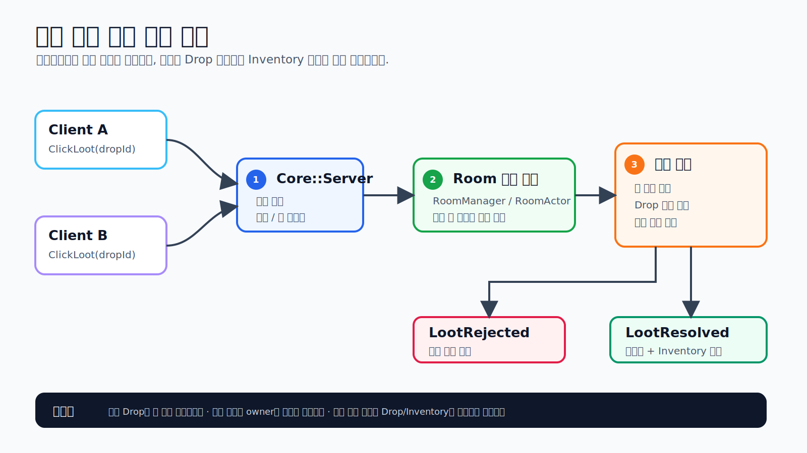
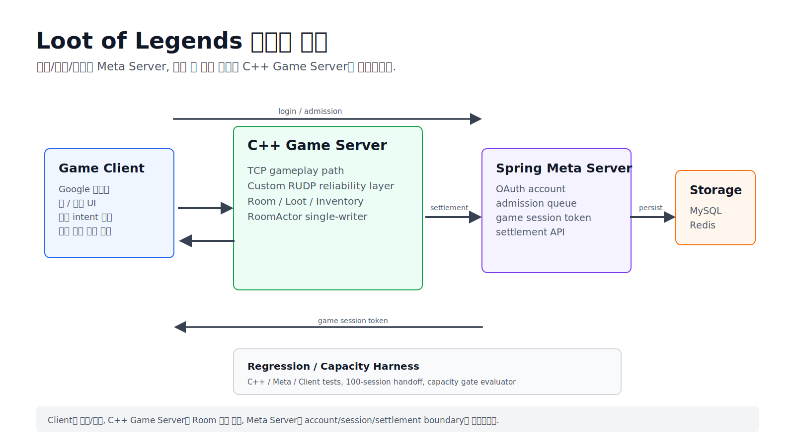
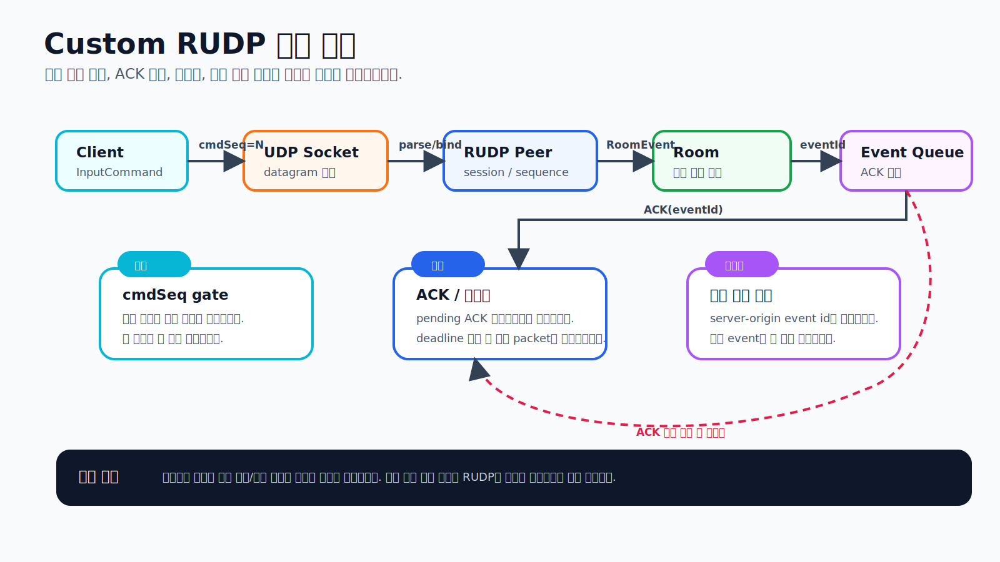

# Loot of Legends

> 클라이언트 입력을 신뢰하지 않고, C++ 서버가 룸 상태와 루팅 결과를 최종 판정하는 서버 권위 멀티플레이 프로젝트입니다.

`C++17` · `POSIX/BSD Socket` · `TCP/UDP` · `Custom RUDP` · `GoogleTest` · `Java 21` · `Spring Boot` · `MySQL/Redis` · `Unity`

## 30초 요약

- 클라이언트는 이동/준비/루팅 같은 입력 의도만 보내고, 서버가 `Room`, `Drop`, `Inventory`, `SettlementResult`를 확정합니다.
- 같은 아이템을 여러 플레이어가 동시에 클릭해도 서버는 한 명에게만 소유권을 부여하고, 이후 중복 요청은 결과를 바꾸지 않습니다.
- UDP 기반 신뢰성 계층(Custom RUDP)은 패킷 직렬화, 순서 번호, ACK, 재전송, 중복 처리 방지, 순서 보장 서버 이벤트까지 구현/테스트했습니다.
- 룸 단위 단일 처리 모델(`RoomActor`)과 워커 풀 기반 구조는 회귀 테스트로 검증된 기반 단계입니다.
- 공개 소스 기준 테스트 선언은 C++ 659개, Meta Server 221개, Unity EditMode 388개입니다.

## 데모

macOS 빌드:

[LootOfLegendsRelease0-macOS-latest.zip](https://drive.google.com/file/d/1-D2CrmA-sqj6L3-D1i6zU7nOo2w_Fqvp/view?usp=sharing)

실행 조건:

- `LootOfLegendsRelease0.app` 실행
- Google 로그인
- 초대 코드 `0621`
- 서버가 켜져 있어야 정상 접속

zip 안의 `README.txt`에도 실행 순서와 macOS 보안 경고 대응 방법을 적어 두었습니다.

## 서버 권위 루팅 흐름



핵심은 `ClickLoot`의 성공 여부가 클라이언트 주장이나 화면 상태로 결정되지 않는다는 점입니다. 서버가 현재 룸 상태, 드롭 소유권, 인벤토리 무게를 기준으로 결과를 한 번만 확정합니다.

대표 코드:

| 목적 | 파일 |
| --- | --- |
| 룸/몬스터/드롭/루팅 판정 | `server/src/Game/RoomManager.cpp`, `server/src/Game/Room.cpp` |
| 서버 런타임과 패킷 라우팅 | `server/src/Core/Server.cpp` |
| 룸 단위 단일 처리 모델 | `server/src/Game/RoomActor.cpp`, `server/src/Game/RoomEventDispatcher.cpp` |
| 응답/브로드캐스트 분리 | `server/src/Game/OutboundSendQueue.hpp` |

## 전체 구조



| 영역 | 현재 검증 수준 | 대표 위치 |
| --- | --- | --- |
| C++ 게임 서버 | TCP 기준 게임 루프, 룸 상태, 루팅 판정, 정산 payload 검증 | `server/`, `tests/core/` |
| Custom RUDP | 프로토콜 계층과 서버 이벤트 신뢰성 검증 | `server/src/Net/`, `tests/protocol/` |
| 룸 단위 단일 처리 | 같은 룸 이벤트 순차 처리와 다중 룸 격리 회귀 테스트 | `server/src/Game/RoomActor.cpp`, `tests/core/RoomActorTests.cpp` |
| Spring Meta Server | OAuth, 입장 대기열, 게임 세션 토큰, 정산 멱등성 테스트 | `meta-server/src/main/java/com/lol/meta/`, `meta-server/src/test/` |
| Unity Client | Standalone 로그인/로비/룸/네트워크/루팅 UI EditMode 테스트 | `client/unity_player_client/Assets/` |
| 부하/안정성 | 측정 결과를 PASS/FAIL로 판정하는 스크립트와 schema | `scripts/release0/`, `scripts/release1/` |

## Custom RUDP

이 프로젝트의 RUDP는 “UDP 소켓을 열었다” 수준이 아니라, 게임 입력과 서버 이벤트를 안전하게 싣기 위한 얇은 신뢰성 계층입니다.



| 구성 | 역할 | 대표 파일 |
| --- | --- | --- |
| 패킷 표면 | `Hello`, `InputCommand`, `ACK`, `BattleStart`, `GameEvent`, `MetaResponse`, `StateSnapshot` 직렬화 | `server/src/Net/RudpPacket.cpp`, `server/src/Net/RudpGameEventPayload.cpp` |
| 세션 바인딩 | UDP endpoint를 TCP로 인증된 세션과 연결 | `server/src/Net/RudpSessionBinder.cpp` |
| 입력 순서 보장 | `cmdSeq` 기반 이전/중복 입력 차단 | `server/src/Net/RudpInputCommandSequenceTracker.cpp`, `server/src/Net/RudpMoveInputGuard.cpp` |
| ACK/재전송 | pending ACK 메타데이터, 재전송 scan/flush | `server/src/Net/RudpReliableSendQueue.cpp`, `server/src/Net/RudpRetransmissionScan.cpp` |
| 서버 이벤트 신뢰성 | event id 멱등성, 중복 전달 방지, 순서 보장 queue | `server/src/Net/RudpReliableEventSendQueue.cpp`, `server/src/Net/RudpGameplayEventIdempotencyTracker.cpp` |
| 룸 이벤트 연결 | 검증된 RUDP 입력을 `RoomEvent`로 변환 | `server/src/Core/RudpInputCommandRoomEventTranslator.cpp` |

현재 기준 게임 플레이의 주 경로는 TCP입니다. RUDP는 이동 입력과 서버 이벤트 신뢰성 계층을 중심으로 구현/검증했으며, 모든 게임 결과 전송이 RUDP로 완전히 전환됐다고 주장하지 않습니다.

## 검증 근거

| 보장하려는 동작 | 대표 테스트 |
| --- | --- |
| 한 세션은 동시에 하나의 룸에만 속함 | `tests/core/RoomManagerTests.cpp` |
| 모든 플레이어 Ready 이후 BattleStart는 한 번만 발생 | `tests/core/RoomManagerTests.cpp`, `tests/core/ServerRoomIntegrationTests.cpp` |
| 같은 Drop은 한 명만 획득 가능 | `tests/core/RoomManagerTests.cpp`, `tests/core/ServerRoomIntegrationTests.cpp` |
| 이미 획득된 Drop은 owner가 바뀌지 않음 | `tests/core/RoomManagerTests.cpp` |
| 무게 제한 초과 루팅은 Drop/Inventory를 변경하지 않음 | `tests/core/RoomManagerTests.cpp` |
| 반복 finish session은 같은 정산 payload 반환 | `tests/core/RoomManagerTests.cpp`, `tests/core/ServerRoomIntegrationTests.cpp` |
| RUDP 재전송/ACK/중복 이벤트 방지 | `tests/protocol/RudpReliableEventSendQueueTests.cpp`, `tests/protocol/RudpReliableEventDeliveryGuardTests.cpp` |
| 같은 룸 이벤트는 단일 처리 경계에서 순차 처리 | `tests/core/RoomActorTests.cpp`, `tests/core/RoomEventDispatcherTests.cpp` |
| Meta 정산 API는 멱등성과 rollback invariant를 유지 | `meta-server/src/test/java/com/lol/meta/settlement/SettlementServiceIdempotencyTests.java`, `meta-server/src/test/java/com/lol/meta/settlement/SettlementRollbackInvariantTests.java` |
| Unity Client는 서버 확정 상태를 렌더링 | `client/unity_player_client/Assets/Tests/EditMode/PlayerNetworkSessionTests.cs`, `client/unity_player_client/Assets/Tests/EditMode/PlayerInventoryStatusRendererTests.cs` |

테스트 개수는 자랑용 숫자보다 회귀 방지 밀도를 보여주는 보조 지표입니다.

| 영역 | 테스트 선언 기준 |
| --- | ---: |
| C++ GoogleTest | 659 |
| Meta Server JUnit | 221 |
| Unity EditMode | 388 |
| 합계 | 1,268 |

## 부하/안정성 검증

| 항목 | 의미 | 위치 |
| --- | --- | --- |
| 100세션 인계 검증 | 활성 세션 이후 대기열 승격과 게임 세션 인증 인계를 검증 | `scripts/release0/handoff_100_sessions_harness.py` |
| 부하 리포트 | 지연 시간, 전달률, tick/resource 기준을 PASS/FAIL/INVALID/ABORTED로 판정 | `scripts/release1/capacity_report.py`, `scripts/release1/gate_config.json` |
| 로컬 진단 | 안전 동접 수 홍보가 아니라 실패 단계와 backlog를 분리하기 위한 진단 | `docs/test_matrix.md` |

동접 숫자를 크게 보이게 쓰기보다, 어떤 조건을 통과/실패로 볼지 코드로 고정하는 데 초점을 뒀습니다.

## 빠른 검증

C++ 서버와 테스트:

```bash
cmake -S . -B build
cmake --build build
ctest --test-dir build --output-on-failure
```

Meta Server:

```bash
cd meta-server
./gradlew test
```

부하/리포트 스크립트:

```bash
python3 -m unittest \
  scripts.release0.test_handoff_100_sessions_harness \
  scripts.release1.test_capacity_report \
  scripts.release1.test_concurrent_capacity_probe
```

Unity 테스트는 Unity Test Runner에서 `client/unity_player_client/Assets/Tests/EditMode/`를 실행합니다.

## 현재 한계

- Standalone 데모는 서버가 켜져 있어야 접속됩니다.
- 게임 플레이의 기준 경로는 TCP이며, RUDP는 프로토콜/입력/서버 이벤트 신뢰성 계층 검증이 중심입니다.
- `RoomActor`와 `WorkerPool`은 단일 처리 모델과 회귀 테스트 기반이며, 전체 운영 런타임이 완전한 다중 워커 구조로 전환됐다는 뜻은 아닙니다.
- 공개 저장소에는 배포 세부 정보, 내부 ADR, 작업 로그, 원본 실험 로그, Unity 빌드 산출물을 포함하지 않습니다.

## 코드 읽기 순서

| 순서 | 보면 좋은 파일 |
| ---: | --- |
| 1 | `server/src/Core/Server.cpp` |
| 2 | `server/src/Game/RoomManager.cpp`, `server/src/Game/Room.cpp` |
| 3 | `server/src/Game/RoomEvent.hpp`, `server/src/Game/RoomActor.cpp` |
| 4 | `server/src/Net/TcpPacket.cpp`, `server/src/Net/TcpPacketReader.cpp` |
| 5 | `server/src/Net/RudpPacket.cpp`, `server/src/Net/RudpReliableEventSendQueue.cpp` |
| 6 | `meta-server/src/main/java/com/lol/meta/settlement/` |
| 7 | `client/unity_player_client/Assets/Scripts/LootOfLegends/PlayerNetworkSession.cs` |

## 공개 범위

이 저장소는 public portfolio mirror입니다.

포함:

- `server/`
- `meta-server/`
- `client/unity_player_client/`
- `tests/`
- `scripts/release0`, `scripts/release1`
- public docs와 README용 자료

제외:

- 내부 ADR, planning, review trace, agent workflow 문서
- OCI 배포 세부 설정과 운영용 secret
- raw experiment logs와 private closeout 문서
- Unity build output, generated artifacts, third-party asset package

보강 문서: [아키텍처](docs/architecture.md), [테스트 매트릭스](docs/test_matrix.md), [로드맵](docs/roadmap.md)
