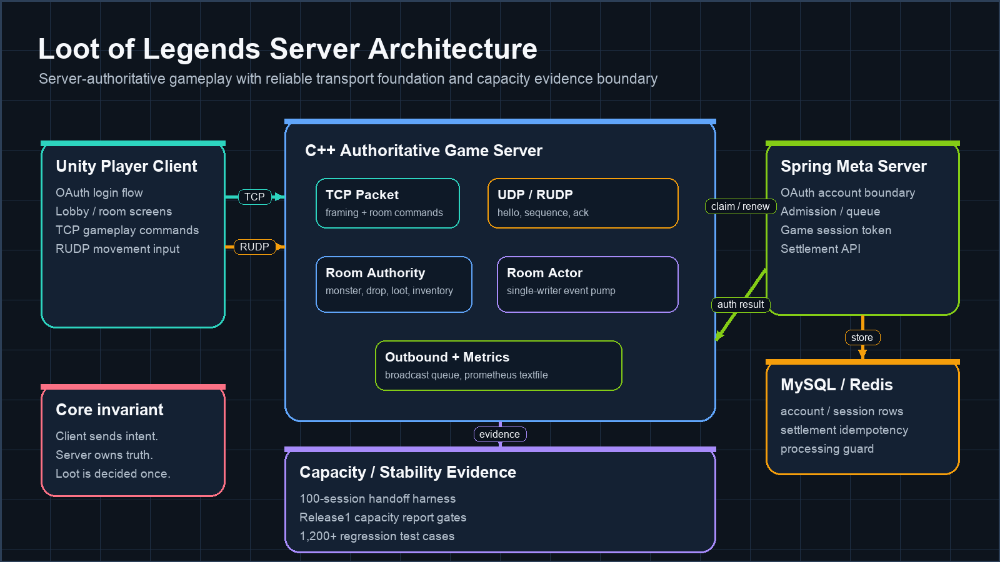
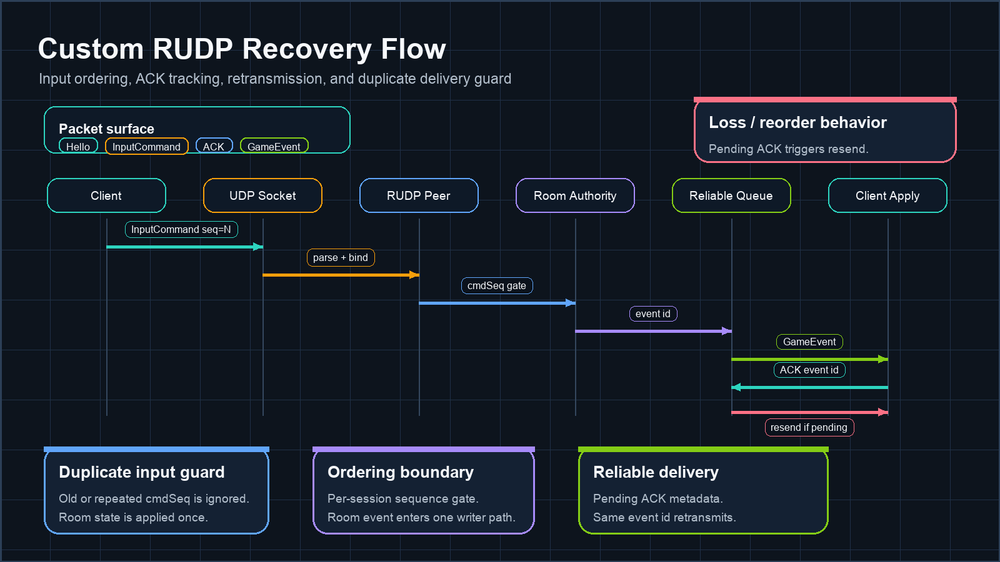

# Loot of Legends

> 클라이언트 입력을 신뢰하지 않고, 서버가 Room 상태와 루팅 결과를 최종 판정하는 C++ 실시간 멀티플레이 서버 포트폴리오입니다.

`C++17` · `CMake` · `POSIX/BSD Sockets` · `TCP/UDP` · `Custom RUDP` · `GoogleTest` · `Java 21` · `Spring Boot` · `MySQL/Redis` · `Unity Player Client`

## 요약

- C++ 서버가 로그인 이후 game session, Room, Ready, Monster, Drop, Loot, Inventory, SettlementResult 흐름을 권위적으로 처리합니다.
- Unity Player Client는 서버가 확정한 상태만 표시하고, Room/Loot/RUDP 입력은 intent로만 전송합니다.
- Custom RUDP는 `Hello`, `InputCommand`, `ACK`, reliable ordered server event, `StateSnapshot`까지 source/test 범위에 포함합니다.
- Spring Meta Server는 OAuth/account, admission/queue, game-session token, settlement idempotency 경계를 담당합니다.
- 100-session handoff harness, Release1 capacity report gate, 1,200+ regression test case marker를 공개 소스에서 확인할 수 있습니다.

이 프로젝트에서 보여주고 싶은 핵심은 화면 연출보다 서버의 판정 구조입니다. 같은 Drop을 여러 클라이언트가 동시에 클릭해도 서버는 한 명에게만 소유권을 확정하고, 나머지 요청은 기존 결과를 바꾸지 않습니다.

## 한눈에 보는 서버 구조



| 경계 | 역할 | 대표 코드 |
| --- | --- | --- |
| Unity Player Client | 로그인, 로비, Room, RUDP movement, loot result 표시 | `client/unity_player_client/Assets/Scripts/LootOfLegends/` |
| C++ Game Server | TCP/RUDP packet 처리, Room 권위 상태, loot 판정, metrics 출력 | `server/src/Core/Server.cpp`, `server/src/Game/RoomManager.cpp` |
| Room Actor foundation | 같은 Room event를 single-writer 경계로 순차 처리하는 기반 | `server/src/Game/RoomActor.cpp`, `server/src/Game/WorkerPool.cpp` |
| Spring Meta Server | OAuth, admission queue, game session token, settlement API | `meta-server/src/main/java/com/lol/meta/` |
| Capacity / Stability harness | handoff, capacity gate, latency/delivery/resource report contract | `scripts/release0/`, `scripts/release1/` |

## Playable Demo

현재 public repo에는 실행 파일을 직접 올리지 않고, 데모 클라이언트 소스와 패키징 스크립트만 둡니다.

- Unity Player Client source: `client/unity_player_client/`
- client config 기본값: `client/unity_player_client/Assets/StreamingAssets/Release0ClientConfig.json`
- standalone package helper: `scripts/release0/unity_standalone_package.py`

데모 링크를 공개할 때는 이 섹션에 빌드 파일 URL과 실행 조건만 짧게 추가하면 됩니다. 지금 README는 source mirror 기준입니다.

## Custom RUDP



| 구성 | 현재 포함된 범위 | 대표 파일 |
| --- | --- | --- |
| Packet surface | `Hello`, `InputCommand`, `ACK`, `BattleStart`, `GameEvent`, `MetaResponse`, `StateSnapshot` payload codec | `server/src/Net/RudpPacket.cpp`, `server/src/Net/Rudp*Payload.cpp` |
| Session binding | UDP endpoint를 TCP session id와 연결 | `server/src/Net/RudpSessionBinder.cpp` |
| Input ordering | `cmdSeq` 기반 stale/duplicate input guard | `server/src/Net/RudpInputCommandSequenceTracker.cpp`, `server/src/Net/RudpMoveInputGuard.cpp` |
| Reliable send | pending ACK metadata, retransmission scan/flush, send queue | `server/src/Net/RudpReliableSendQueue.cpp`, `server/src/Net/RudpRetransmissionScan.cpp` |
| Reliable ordered event | server-origin event idempotency, duplicate delivery guard, reliable event queue | `server/src/Net/RudpReliableEventSendQueue.cpp`, `server/src/Net/RudpGameplayEventIdempotencyTracker.cpp` |
| Room dispatch | RUDP input을 RoomEvent 경계로 변환 | `server/src/Core/RudpInputCommandRoomEventTranslator.cpp` |

RUDP를 “UDP로 보냈다” 수준으로 적지 않기 위해 packet codec, ordering, ACK, retransmission, duplicate guard를 분리했습니다. 다만 모든 gameplay result가 RUDP로 전환됐다는 뜻은 아닙니다. public 기준으로는 TCP gameplay path가 여전히 기준 경로이고, RUDP는 movement/reliable event foundation과 테스트 범위까지 공개합니다.

## 서버 권한 Gameplay

| 불변식 | 검증 위치 |
| --- | --- |
| 한 세션은 동시에 하나의 Room에만 속한다 | `tests/core/RoomManagerTests.cpp` |
| Ready가 모두 모였을 때 BattleStart는 한 번만 발생한다 | `tests/core/RoomManagerTests.cpp`, `tests/core/ServerRoomIntegrationTests.cpp` |
| 같은 Drop은 한 명만 claim할 수 있다 | `tests/core/RoomManagerTests.cpp`, `tests/core/ServerRoomIntegrationTests.cpp` |
| 이미 claim된 Drop은 owner를 바꾸지 않는다 | `tests/core/RoomManagerTests.cpp` |
| 무게 제한 초과 loot는 Drop/Inventory를 변경하지 않는다 | `tests/core/RoomManagerTests.cpp` |
| 반복 finish session은 같은 settlement payload를 반환한다 | `tests/core/RoomManagerTests.cpp`, `tests/core/ServerRoomIntegrationTests.cpp` |

## Capacity / Stability 검증

| 근거 | 의미 | 위치 |
| --- | --- | --- |
| 100-session handoff harness | 100개 active session 이후 queue promotion과 game-session authentication handoff를 검증하는 harness | `scripts/release0/handoff_100_sessions_harness.py` |
| Release1 capacity report gate | latency, delivery, tick/stability, resource gate를 PASS/FAIL/INVALID/ABORTED로 판정하는 report contract | `scripts/release1/capacity_report.py`, `scripts/release1/gate_config.json` |
| 670-session local diagnostic | safe capacity 숫자가 아니라 failure stage와 backlog를 분리하기 위한 로컬 진단 기준 | `docs/test_matrix.md` |
| 1,200+ regression cases | C++/Meta/Unity test marker 기준 공개 소스의 회귀 검증 밀도 | `tests/`, `meta-server/src/test/`, `client/unity_player_client/Assets/Tests/EditMode/` |

capacity 숫자는 최대 동접 홍보 문구로 쓰지 않습니다. 이 repo에서는 어떤 gate로 측정하고, 어떤 단계가 PASS/FAIL/INVALID인지 구분하는 구조를 더 중요하게 둡니다.

## 코드 읽기 가이드

| 목적 | 시작 파일 |
| --- | --- |
| 서버 lifecycle / TCP-RUDP runtime | `server/src/Core/Server.cpp` |
| Room, Monster, Drop, Loot, Inventory | `server/src/Game/RoomManager.cpp`, `server/src/Game/Room.cpp` |
| Room Actor / WorkerPool foundation | `server/src/Game/RoomEvent.hpp`, `server/src/Game/RoomActor.cpp`, `server/src/Game/WorkerPool.cpp` |
| TCP packet contract | `server/src/Net/TcpPacket.cpp`, `server/src/Net/TcpPacketReader.cpp` |
| Custom RUDP packet / recovery | `server/src/Net/RudpPacket.cpp`, `server/src/Net/RudpReliableEventSendQueue.cpp` |
| Meta auth/admission/session | `meta-server/src/main/java/com/lol/meta/auth/`, `meta-server/src/main/java/com/lol/meta/admission/` |
| Meta settlement | `meta-server/src/main/java/com/lol/meta/settlement/` |
| Unity Player Client runtime | `client/unity_player_client/Assets/Scripts/LootOfLegends/PlayerNetworkSession.cs` |

## 빠른 검증

C++ server/tests:

```bash
cmake -S . -B build
cmake --build build
ctest --test-dir build --output-on-failure
```

Meta Server:

```bash
cd meta-server
./gradlew test
```

Python capacity/report helpers:

```bash
python3 -m unittest \
  scripts.release0.test_handoff_100_sessions_harness \
  scripts.release1.test_capacity_report \
  scripts.release1.test_concurrent_capacity_probe
```

Unity Player Client tests는 Unity Test Runner에서 `client/unity_player_client/Assets/Tests/EditMode/`를 실행합니다.

## 공개 범위

이 저장소는 public portfolio mirror입니다.

포함:

- `README.md`, public docs, architecture images
- `server/`
- `meta-server/`
- `client/unity_player_client/`
- `tests/`
- `scripts/release0`, `scripts/release1`의 실행 가능한 source/test/schema

제외:

- 내부 ADR, planning, review trace, agent workflow 문서
- deploy workflow와 OCI 세부 배포 파일
- raw experiment logs와 private closeout 문서
- Unity build output, generated artifacts, third-party asset package

자세한 보강 문서는 [아키텍처](docs/architecture.md), [테스트 매트릭스](docs/test_matrix.md), [로드맵](docs/roadmap.md)에만 둡니다.
